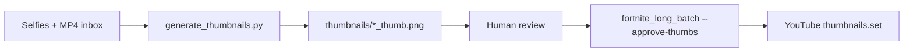

# Thumbnails workflow — YouTube (manual today, automation later)

> **EN + PT** · Custom thumbnails for [@abobicaduco](https://www.youtube.com/@abobicaduco) long-form and Shorts.  
> **No API keys or tokens in this repo.**

Related: [content/FORTNITE_MOBILE.md](content/FORTNITE_MOBILE.md) · [youtube/HANDOFF.md](youtube/HANDOFF.md) · [PLATFORMS.md](PLATFORMS.md)

---

## Current workflow (manual, Gemini paid)

1. After gameplay is recorded and batch files exist in inbox, open **Google Gemini** (paid tier) in the browser.
2. Generate **4 thumbnail variants** per video (or per batch day).
3. **Human review** — pick the best variant; adjust text/contrast if needed.
4. Export **1280×720** JPEG (YouTube custom thumbnail safe zone).
5. Save next to the batch (see naming below).
6. After upload, pipeline can call **YouTube Data API** `thumbnails.set` when `thumb_path` is set (see [API flow](#youtube-api-flow-conceptual)).

**Publish gate:** do not schedule/publich until the approved thumbnail file exists on disk (or you explicitly accept the YouTube auto-frame).

---

## File naming and folder

| Item | Convention |
|------|------------|
| **Folder** | `%USERPROFILE%\YOUTUBE\inbox\<batch_id>\thumbnails\` (sibling to MP4s and `manifest.csv`) |
| **Pattern** | `<batch_prefix>_<NN>_thumb.jpg` |
| **Example** | `fortnite_mobile_01_thumb.jpg` … `fortnite_mobile_04_thumb.jpg` |

Fortnite batch (`fortnite_mobile_20260530`):

```
inbox/fortnite_mobile_20260530/
├── fortnite_mobile_01.mp4
├── thumbnails/
│   ├── fortnite_mobile_01_thumb.jpg
│   └── …
├── batch.yaml
└── manifest.csv
```

**Optional batch default:** `thumbnail:` key in `batch.yaml` (see `scripts/youtube/templates/batch.example.yaml`).

**Per-clip override:** `thumb_path` / `thumbnail` column in manifest or `clips_metadata.json` (resolved in `scripts/youtube/manifest.py`).

---

## YouTube API flow (conceptual)

1. `videos.insert` — upload video (private until `publishAt` if scheduled).
2. `thumbnails.set` — upload JPEG/PNG with OAuth scope that includes YouTube upload access.
3. Implementation: `YouTubeUploader.set_thumbnail()` in `scripts/youtube/uploader.py` (retries on transient errors; upload still succeeds if thumb fails).

**Requirements (Google policy):**

- Channel verified for custom thumbnails (subscriber threshold).
- Image ≤ 2 MB, JPG/PNG, recommended **1280×720**.

**No credentials here** — OAuth token lives only under `%USERPROFILE%\.secrets\youtube_token.json` (gitignored).

---

## Wiring thumbnails into upload

| Method | How |
|--------|-----|
| **batch.yaml** | `thumbnail: "%USERPROFILE%/YOUTUBE/inbox/.../thumbnails/fortnite_mobile_01_thumb.jpg"` |
| **manifest.csv** | Add column or use metadata JSON with `thumb_path` per file |
| **Pipeline** | `ClipEntry.thumb_path` passed to uploader after `videos.insert` |

Dry-run logs `[DRY-RUN] Would set thumbnail: …` when path is valid.

---

## API automation

**Script:** `scripts/generate_thumbnails.py` (core: `scripts/thumbnails/gemini_generate.py`)

### Google AI Pro (consumer) vs API key vs Vertex

| Surface | What it is | Programmatic image gen? |
|---------|------------|-------------------------|
| **Gemini app / Google AI Pro** (~R$90/mo) | Browser chat at [gemini.google.com](https://gemini.google.com) | **No** — subscription does **not** replace an API key for scripts |
| **Google AI Studio + API key** | [aistudio.google.com/api-keys](https://aistudio.google.com/api-keys) → `generativelanguage.googleapis.com` | **Yes** — this is what the pipeline uses |
| **Vertex AI (Google Cloud)** | Enterprise GCP billing, IAM, regions | **Yes** — separate SDK/billing; not required for this repo |

**Takeaway:** Google AI Pro helps you iterate prompts in the browser, but **automation needs an AI Studio API key** on the same Google account (or linked Cloud project). Paid API usage is metered per image/token — it is **not** bundled into the consumer Gemini subscription quota.

**Models (Nano Banana family, May 2026):**

| Model ID | Role |
|----------|------|
| `gemini-2.5-flash-image` | Default in script — fast, good for batches |
| `gemini-3.1-flash-image` | Higher volume / newer; supports reference images + 16:9 |
| `gemini-3-pro-image` | Best text rendering; higher cost |

Features used by the script:

- **16:9** via `ImageConfig(aspect_ratio="16:9")`
- **Face reference** — selfie sent as multimodal input (character consistency)
- Post-process resize to **1280×720** with Pillow (YouTube safe size)

### One-time setup (API key)

1. Open [Google AI Studio → API keys](https://aistudio.google.com/api-keys) (same Google account as Gemini Pro is fine).
2. **Create API key** → pick or create a Google Cloud project → copy key once.
3. Add to `%USERPROFILE%\.secrets\api-keys.json` (never commit):

```json
{
  "google": { "api_key": "YOUR_AI_STUDIO_KEY" }
}
```

Also supported (first match wins): env `GEMINI_API_KEY` / `GOOGLE_API_KEY`, keys `google_ai`, `gemini`, or `custom.google_gemini.api_key`.

4. Install deps: `pip install google-genai Pillow` (see root `requirements.txt`).

**Restrict the key** in AI Studio (HTTP referrer or IP) — unrestricted keys are being phased out in 2026.

### Troubleshooting

| Error | Likely cause | Fix |
|-------|--------------|-----|
| `API key missing` | No entry in api-keys / env | Follow setup above |
| `403 API_KEY_SERVICE_BLOCKED` | Key created without Generative Language API, or API disabled in Cloud Console | [Create key at AI Studio](https://aistudio.google.com/api-keys) (not a random GCP key); enable **Generative Language API** on the linked project |
| `403 PERMISSION_DENIED` (billing) | Image models require paid API quota | Enable billing on the Cloud project linked to the key |
| `Need N distinct face photos` | Not enough selfies in `--faces-dir` | Add more images or lower `--count` |

Consumer **Google AI Pro** subscription alone does not unblock API errors — you still need a valid AI Studio key with image model access.

### CLI usage

```powershell
python scripts/generate_thumbnails.py `
  --faces-dir "$env:USERPROFILE\Pictures\faces" `
  --videos-dir "$env:USERPROFILE\YOUTUBE\inbox\fortnite_mobile_20260530" `
  --game "Fortnite Mobile"
```

| Flag | Purpose |
|------|---------|
| `--faces-dir` | Folder of face selfies (jpg/png) — **one distinct face per video, no reuse in one run** |
| `--videos-dir` | Folder of MP4s; output goes to `videos-dir/thumbnails/{stem}_thumb.png` |
| `--game` | Prompt theme set (`Fortnite Mobile`, `Granny 2`, … — see `scripts/thumbnails/prompts.py`) |
| `--count N` | Override auto-count of `.mp4` files |
| `--dry-run` | Plan prompts/paths only — no API calls |
| `--force` | Regenerate even if thumb already exists |
| `--model` | Override Gemini image model ID |

**Human gate:** review generated PNGs before upload. Use `--approve-thumbs` on `fortnite_long_batch.py` to block YouTube upload until every expected thumb exists.

### Pipeline integration



| Piece | Status |
|-------|--------|
| Prompt templates (PT-BR, Alanzoka/Bistecon) | `scripts/thumbnails/prompts.py` |
| Gemini client + face reference | `scripts/thumbnails/gemini_generate.py` |
| CLI wrapper | `scripts/generate_thumbnails.py` |
| `fortnite_long_batch --generate-thumbs` | Calls generator before copy/manifest |
| Frame grab (ffmpeg) | Not implemented — optional future |

### API key storage

- **Canonical reference doc:** `AI_CREDENTIALS.md` (user home — lists *where* keys live, not values).
- **Local JSON:** `%USERPROFILE%\.secrets\api-keys.json` — e.g. `google.api_key`.
- **Env override:** `GEMINI_API_KEY` or `GOOGLE_API_KEY`.

Agents: **never** read or paste `api-keys.json` / `youtube_token.json` into chat or commits.

---

## Suggested prompt template (Fortnite Mobile, PT-BR, 1280×720)

Use as a **structure** — replace `{episode}`, `{hook}`, `{brand}`:

```text
Crie uma thumbnail de YouTube 1280x720 para gameplay de Fortnite Mobile.

Canal: {brand} (@abobicaduco)
Episódio: {episode}
Estilo: alto contraste, texto grande em português (máx. 4 palavras), rosto/personagem em destaque, fundo borrado do gameplay.
Cores: roxo/azul neon + amarelo para CTA.
Proibido: logos oficiais da Epic, blood/gore, texto ilegível, mais de 3 linhas de texto.
Entregue 4 variações com hooks diferentes: {hook}
```

**Human review checklist:**

- [ ] Text readable at mobile size  
- [ ] No trademark violations  
- [ ] Matches video title/topic  
- [ ] File name matches `fortnite_mobile_NN_thumb.jpg`  
- [ ] Approved file in `thumbnails/` before upload run  

---

## Security

| Never commit | Notes |
|--------------|--------|
| `youtube_token.json`, `youtube_client_secret.json` | OAuth |
| `api-keys.json` | Gemini / other APIs |
| `*.db` | Schedule state |
| Full-size thumbnail exports with personal email/watermarks | Optional `.gitignore` under inbox if syncing folder |

Use `%USERPROFILE%` and `~/.secrets/` in docs — not machine-specific drive letters except as examples in LOCAL_SETUP.

---

*Last updated: 2026-05-30*
