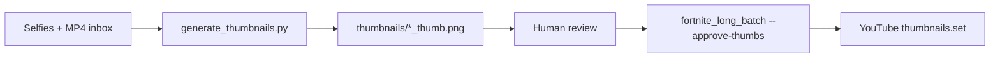

# Thumbnails workflow — YouTube (manual today, automation later)

> **EN + PT** · Custom thumbnails for [@abobicaduco](https://www.youtube.com/@abobicaduco) long-form and Shorts.  
> **No API keys or tokens in this repo.**

Related: [content/FORTNITE_MOBILE.md](content/FORTNITE_MOBILE.md) · [youtube/HANDOFF.md](youtube/HANDOFF.md) · [PLATFORMS.md](PLATFORMS.md)

**Local face photos:** default folder `%USERPROFILE%\Pictures\EU` (one selfie per video). Machine-specific paths and full examples → **`docs/LOCAL_USER_PATHS.md`** (local only, gitignored — create from this doc on each PC).

---

## Current workflow (manual, Gemini paid)

1. After gameplay is recorded and batch files exist in inbox, open **Google Gemini** (paid tier) in the browser.
2. Generate **4 thumbnail variants** per video (or per batch day).
3. **Human review** — pick the best variant; adjust text/contrast if needed.
4. Export **1280×720** JPEG (YouTube custom thumbnail safe zone).
5. Save next to the batch (see naming below).
6. After upload, pipeline can call **YouTube Data API** `thumbnails.set` when `thumb_path` is set (see [API flow](#youtube-api-flow-conceptual)).

**Publish gate:** do not schedule/publich until the approved thumbnail file exists on disk (or you explicitly accept the YouTube auto-frame).

---

## File naming and folder

| Item | Convention |
|------|------------|
| **Folder** | `%USERPROFILE%\YOUTUBE\inbox\<batch_id>\thumbnails\` (sibling to MP4s and `manifest.csv`) |
| **Pattern** | `<batch_prefix>_<NN>_thumb.jpg` |
| **Example** | `fortnite_mobile_01_thumb.jpg` … `fortnite_mobile_04_thumb.jpg` |

Fortnite batch (`fortnite_mobile_20260530`):

```
inbox/fortnite_mobile_20260530/
├── fortnite_mobile_01.mp4
├── thumbnails/
│   ├── fortnite_mobile_01_thumb.jpg
│   └── …
├── batch.yaml
└── manifest.csv
```

**Optional batch default:** `thumbnail:` key in `batch.yaml` (see `scripts/youtube/templates/batch.example.yaml`).

**Per-clip override:** `thumb_path` / `thumbnail` column in manifest or `clips_metadata.json` (resolved in `scripts/youtube/manifest.py`).

---

## YouTube API flow (conceptual)

1. `videos.insert` — upload video (private until `publishAt` if scheduled).
2. `thumbnails.set` — upload JPEG/PNG with OAuth scope that includes YouTube upload access.
3. Implementation: `YouTubeUploader.set_thumbnail()` in `scripts/youtube/uploader.py` (retries on transient errors; upload still succeeds if thumb fails).

**Requirements (Google policy):**

- Channel verified for custom thumbnails (subscriber threshold).
- Image ≤ 2 MB, JPG/PNG, recommended **1280×720**.

**No credentials here** — OAuth token lives under `<repo>/.secrets/youtube_token.json` or `%USERPROFILE%\.secrets\scripts\` (gitignored).

---

## Wiring thumbnails into upload

| Method | How |
|--------|-----|
| **batch.yaml** | `thumbnail: "%USERPROFILE%/YOUTUBE/inbox/.../thumbnails/fortnite_mobile_01_thumb.jpg"` |
| **manifest.csv** | Add column or use metadata JSON with `thumb_path` per file |
| **Pipeline** | `ClipEntry.thumb_path` passed to uploader after `videos.insert` |

Dry-run logs `[DRY-RUN] Would set thumbnail: …` when path is valid.

---

## Automation — comparison (May 2026)

| Approach | Script | Auth | Works today? | Best for |
|----------|--------|------|--------------|----------|
| **Official API** | `generate_thumbnails.py` | AI Studio API key + billing | **Blocked** on YouTube GCP project (`API_KEY_SERVICE_BLOCKED`) | Stable pipelines once key is fixed |
| **Browser headed** | `gemini-thumbnails.py` | Google login → `gemini_storage_state.json` | **Yes** (Gemini Pro quota) | Batch thumbs without API billing |
| **Browser headless** | `gemini-thumbnails.py --headless` | Same `storage_state` | **Conditional** — Google may redirect to sign-in | Unattended runs after `--verify-session` |
| **Web RPC direct** | Not implemented | Cookie `SAPISIDHASH` | **No** — reverse-engineering only | Not recommended (ToS + fragility) |

Details: [GEMINI_API_VS_PRO.md](GEMINI_API_VS_PRO.md) · [gemini/WEB_API_RESEARCH.md](gemini/WEB_API_RESEARCH.md)

**Recommended path (current account):** use **`gemini-thumbnails.py`** (headed) until a new AI Studio key + billing is set up; then prefer **`generate_thumbnails.py`** for CI/batch stability.

---

## Browser automation (Gemini web)

**Scripts:** `scripts/gemini-thumbnails.py` (CLI) · `scripts/thumbnails/gemini_web.py` (core)

Uses **gemini.google.com** with your **Google AI Pro** subscription — **no** Generative Language API key. Session is saved like TikTok (`storage_state`), not shared with Cursor/Claude chat.

### Pros / cons vs API

| | Browser (Pro session) | Official API |
|--|----------------------|--------------|
| Cost | Already in Pro subscription | Per-image API billing |
| Setup | One-time `--auth-only` login | AI Studio key + billing |
| Stability | DOM selectors break on UI updates | SDK + model IDs |
| Headless | Often blocked after auth | N/A |
| ToS | Gray area (automation of consumer UI) | Supported |

### One-time auth (recomendado: `--auth-cdp`)

Quando o **email do Google fica girando para sempre** após digitar o endereço, o Playwright está sendo tratado como automação. Use **Chrome real** com porta de debug (sem flags do script):

#### Opção A — `--auth-cdp` (padrão recomendado)

**PowerShell** — abra o Chrome (feche outras janelas do mesmo perfil de debug antes):

```powershell
$repo = "C:\Users\carlo\Projects\abobi-shorts-upload-pipeline"
& "C:\Program Files\Google\Chrome\Application\chrome.exe" `
  --remote-debugging-port=9222 `
  --user-data-dir="$repo\.secrets\chrome-debug-gemini"
```

No Chrome que abriu: vá em [gemini.google.com](https://gemini.google.com), faça login (senha e **2FA só no navegador** — nunca no terminal).

**Git Bash** — exportar sessão:

```bash
cd /c/Users/carlo/Projects/abobi-shorts-upload-pipeline
python scripts/gemini-thumbnails.py --auth-cdp
```

1. O script imprime instruções e pede **ENTER** (Chrome com debug já aberto e logado).
2. Conecta em `http://127.0.0.1:9222`, pede **ENTER** de novo para confirmar.
3. Sessão salva em `<repo>/.secrets/gemini_storage_state.json` (gitignored). O Chrome de debug pode ficar aberto.

Porta ou host diferentes: `--auth-cdp-url http://127.0.0.1:9223`

#### Opção B — `--auth-only` (perfil isolado Playwright)

```powershell
python scripts/gemini-thumbnails.py --auth-only
```

1. Chrome instalado abre `gemini.google.com` (perfil `<repo>/.secrets/browser-profile-gemini/`)
2. Login manual + 2FA no celular se pedido
3. **ENTER** no terminal → `gemini_storage_state.json`

Auth-only **não** passa flags extras de automação (só `channel=chrome`, viewport, remove `--enable-automation`). Opcional: `--slow-mo 100` se a UI estiver rápida demais.

Se ainda falhar: `--disable-blink-automation` ou volte para **`--auth-cdp`**.

#### Opção C — perfil Chrome do sistema (arriscado)

```powershell
# Feche TODO o Google Chrome antes
python scripts/gemini-thumbnails.py --auth-only --use-system-chrome-profile
```

Usa `%LOCALAPPDATA%\Google\Chrome\User Data` — risco de corrupção se o Chrome normal estiver aberto. Prefira `--auth-cdp`.

#### Opção D — cookies manuais (sem Playwright no login)

1. Faça login no **Chrome normal** em gemini.google.com.
2. Exporte cookies (extensão tipo “Get cookies.txt” / “Cookie-Editor”) **ou** use `playwright codegen` apontando para o perfil — só para copiar estado; não commite o arquivo.
3. Converta/importe para o formato `storage_state` do Playwright e salve em `<repo>/.secrets/gemini_storage_state.json`, **ou** use `--auth-cdp` depois de logado no Chrome de debug (mais simples).

**Segurança:** nunca cole senha no terminal; não commite `gemini_storage_state.json` nem perfis em `<repo>/.secrets/`.

**Erros de perfil (*Target.createTarget*):** feche o Chrome do script, apague `Singleton*` em `<repo>/.secrets/browser-profile-gemini/` (só com Chrome fechado), tente de novo ou use `--auth-cdp`.

### Verify headed vs headless

```powershell
python scripts/gemini-thumbnails.py --verify-session
```

If `headless_logged_in: False` but headed works, run batch **without** `--headless`.

### Batch generation

```powershell
python scripts/gemini-thumbnails.py `
  --faces-dir "$env:USERPROFILE\Pictures\EU" `
  --videos-dir "$env:USERPROFILE\YOUTUBE\inbox\fortnite_mobile_20260530" `
  --game "Fortnite Mobile"
```

| Flag | Purpose |
|------|---------|
| `--auth-cdp` | Login via Chrome real + porta 9222 (melhor se email gira) |
| `--auth-cdp-url` | Endpoint CDP (default `http://127.0.0.1:9222`) |
| `--auth-only` | Login com perfil isolado Playwright |
| `--slow-mo MS` | Atraso Playwright em ms (`--auth-only` only) |
| `--headless` | No visible window (test with `--verify-session` first) |
| `--sniff-network` | Log RPC URLs to `<repo>/.secrets/gemini_network.log` (no auth headers) |
| `--use-system-chrome-profile` | Use real Chrome profile (OFF default — close all Chrome; risky) |
| `--disable-blink-automation` | Extra Chrome flag only if `--auth-only` still fails |
| `--dry-run` | Plan paths/prompts only |
| `--force` | Regenerate existing thumbs |

**Human gate:** same as API path — review PNGs before upload.

### Network research (internal web API)

Manual capture while you generate one image:

```powershell
python scripts/thumbnails/inspect_gemini_network.py
```

Documented patterns (batchexecute RPC, no secrets): [gemini/WEB_API_RESEARCH.md](gemini/WEB_API_RESEARCH.md).

### Playwright settings

- **Auth:** prefer `--auth-cdp` (attach to real Chrome); `--auth-only` uses `channel="chrome"` only (no bundled Chromium), viewport **1920×1080**, **no** extra `args` unless `--disable-blink-automation`
- **Removed** (trigger Google bot detection): `--no-sandbox`, `--disable-dev-shm-usage`, `--disable-web-security`, `wmic` kill of user Chrome
- `ignore_default_args=["--enable-automation"]` on auth/batch launch
- CDP debug profile: `<repo>/.secrets/chrome-debug-gemini/`
- Batch: headed default; `--headless` optional (often blocked — use `--verify-session`)
- Isolated profile: `<repo>/.secrets/browser-profile-gemini/` (gitignored)
- `page.evaluate` fallbacks when Gemini UI selectors change (selectors are best-effort / TODO when UI shifts)

**Session isolation:** Cursor, Claude, and other agents **do not** inherit `gemini_storage_state.json` — only this local Python CLI uses it.

---

## API automation

**Script:** `scripts/generate_thumbnails.py` (core: `scripts/thumbnails/gemini_generate.py`)

### Google AI Pro (consumer) vs API key vs Vertex

| Surface | What it is | Programmatic image gen? |
|---------|------------|-------------------------|
| **Gemini app / Google AI Pro** (~R$90/mo) | Browser chat at [gemini.google.com](https://gemini.google.com) | **No** — subscription does **not** replace an API key for scripts |
| **Google AI Studio + API key** | [aistudio.google.com/api-keys](https://aistudio.google.com/api-keys) → `generativelanguage.googleapis.com` | **Yes** — this is what the pipeline uses |
| **Vertex AI (Google Cloud)** | Enterprise GCP billing, IAM, regions | **Yes** — separate SDK/billing; not required for this repo |

**Takeaway:** Google AI Pro helps you iterate prompts in the browser, but **automation needs an AI Studio API key** on the same Google account (or linked Cloud project). Paid API usage is metered per image/token — it is **not** bundled into the consumer Gemini subscription quota.

**Models (Nano Banana family, May 2026):**

| Model ID | Role |
|----------|------|
| `gemini-2.5-flash-image` | Default in script — fast, good for batches |
| `gemini-3.1-flash-image` | Higher volume / newer; supports reference images + 16:9 |
| `gemini-3-pro-image` | Best text rendering; higher cost |

Features used by the script:

- **16:9** via `ImageConfig(aspect_ratio="16:9")`
- **Face reference** — selfie sent as multimodal input (character consistency)
- Post-process resize to **1280×720** with Pillow (YouTube safe size)

### One-time setup (API key)

1. Open [Google AI Studio → API keys](https://aistudio.google.com/api-keys) (same Google account as Gemini Pro is fine).
2. **Create API key in new project** — avoid reusing the YouTube/AdSense GCP project (`warm-alliance-457415-d2`). See [GEMINI_API_VS_PRO.md](GEMINI_API_VS_PRO.md).
3. Prefer **Restrict to Gemini API only** when prompted.
4. Add to `%USERPROFILE%\.secrets\api-keys.json` (never commit):

```json
{
  "google": { "api_key": "YOUR_AI_STUDIO_KEY" }
}
```

Also supported (first match wins): env `GEMINI_API_KEY` / `GOOGLE_API_KEY`, keys `google_ai`, `gemini`, or `custom.google_gemini.api_key`.

4. Install deps: `pip install google-genai Pillow` (see root `requirements.txt`).

**Restrict the key** in AI Studio (HTTP referrer or IP) — unrestricted keys are being phased out in 2026.

### Troubleshooting

| Error | Likely cause | Fix |
|-------|--------------|-----|
| `API key missing` | No entry in api-keys / env | Follow setup above |
| `403 API_KEY_SERVICE_BLOCKED` | Chave/projeto GCP (ex.: `190666412179` / `warm-alliance-457415-d2`) **bloqueado** para `generativelanguage` — comum quando a chave veio do Console do projeto YouTube/AdSense | **Nova chave** em [AI Studio](https://aistudio.google.com/api-keys) → **projeto novo** (não reimportar o projeto OAuth). Ver [GEMINI_API_VS_PRO.md](GEMINI_API_VS_PRO.md) |
| `403 PERMISSION_DENIED` (billing) | Modelos de **imagem** não existem no free tier da API | AI Studio → **Set up billing** no projeto da chave (paid tier). Créditos Cloud do Pro (~US$10/mês) podem cobrir uso pequeno |
| `429 RESOURCE_EXHAUSTED` | Rate limit free tier | Backoff; ou billing para tier pago |
| `Need N distinct face photos` | Not enough selfies in `--faces-dir` | Add more images or lower `--count` |

**Reteste 2026-05-30:** chave em `google.api_key` → 403 em `ListModels`, `generateContent` texto e `gemini-2.5-flash-image`; `consumer: projects/190666412179`.

Consumer **Google AI Pro** (browser) **não** desbloqueia API — assinatura ≠ API key. Guia completo: [GEMINI_API_VS_PRO.md](GEMINI_API_VS_PRO.md).

### CLI usage

```powershell
python scripts/generate_thumbnails.py `
  --faces-dir "$env:USERPROFILE\Pictures\EU" `
  --videos-dir "$env:USERPROFILE\YOUTUBE\inbox\fortnite_mobile_20260530" `
  --game "Fortnite Mobile"
```

| Flag | Purpose |
|------|---------|
| `--faces-dir` | Folder of face selfies (jpg/png) — default `%USERPROFILE%\Pictures\EU`; see `LOCAL_USER_PATHS.md` (local, gitignored). **One distinct face per video, no reuse in one run.** |
| `--videos-dir` | Folder of MP4s; output goes to `videos-dir/thumbnails/{stem}_thumb.png` |
| `--game` | Prompt theme set (`Fortnite Mobile`, `Granny 2`, … — see `scripts/thumbnails/prompts.py`) |
| `--count N` | Override auto-count of `.mp4` files |
| `--dry-run` | Plan prompts/paths only — no API calls |
| `--force` | Regenerate even if thumb already exists |
| `--model` | Override Gemini image model ID |

**Human gate:** review generated PNGs before upload. Use `--approve-thumbs` on `fortnite_long_batch.py` to block YouTube upload until every expected thumb exists.

### Pipeline integration



| Piece | Status |
|-------|--------|
| Prompt templates (PT-BR, Alanzoka/Bistecon) | `scripts/thumbnails/prompts.py` |
| Gemini API client + face reference | `scripts/thumbnails/gemini_generate.py` |
| Gemini web (Playwright + storage_state) | `scripts/thumbnails/gemini_web.py` |
| CLI — API path | `scripts/generate_thumbnails.py` |
| CLI — browser path | `scripts/gemini-thumbnails.py` |
| Network inspector | `scripts/thumbnails/inspect_gemini_network.py` |
| `fortnite_long_batch --generate-thumbs` | Calls API generator before copy/manifest |
| Frame grab (ffmpeg) | Not implemented — optional future |
| Gemini web Playwright (`gemini-thumbnails.py`) | Auth, batch, best-effort DOM automation (fragile) |

### API key storage

- **Canonical reference doc:** `AI_CREDENTIALS.md` (user home — lists *where* keys live, not values).
- **Local JSON:** `%USERPROFILE%\.secrets\api-keys.json` (preferred) or `<repo>/.secrets/api-keys.json` — e.g. `google.api_key`.
- **Env override:** `GEMINI_API_KEY` or `GOOGLE_API_KEY`.

Agents: **never** read or paste `api-keys.json` / `youtube_token.json` into chat or commits.

---

## Suggested prompt template (Fortnite Mobile, PT-BR, 1280×720)

Use as a **structure** — replace `{episode}`, `{hook}`, `{brand}`:

```text
Crie uma thumbnail de YouTube 1280x720 para gameplay de Fortnite Mobile.

Canal: {brand} (@abobicaduco)
Episódio: {episode}
Estilo: alto contraste, texto grande em português (máx. 4 palavras), rosto/personagem em destaque, fundo borrado do gameplay.
Cores: roxo/azul neon + amarelo para CTA.
Proibido: logos oficiais da Epic, blood/gore, texto ilegível, mais de 3 linhas de texto.
Entregue 4 variações com hooks diferentes: {hook}
```

**Human review checklist:**

- [ ] Text readable at mobile size  
- [ ] No trademark violations  
- [ ] Matches video title/topic  
- [ ] File name matches `fortnite_mobile_NN_thumb.jpg`  
- [ ] Approved file in `thumbnails/` before upload run  

---

## Security

| Never commit | Notes |
|--------------|--------|
| `youtube_token.json`, `youtube_client_secret.json` | OAuth |
| `gemini_storage_state.json`, `gemini_network.log`, `browser-profile-gemini/`, `chrome-debug-gemini/` | Gemini web — under `<repo>/.secrets/` |
| `api-keys.json` | Gemini / other APIs — prefer `%USERPROFILE%\.secrets\` |
| `*.db` | Schedule state — under `<repo>/.secrets/` |

Use `<repo>/.secrets/` for session/DB files; `%USERPROFILE%` for media and api-keys canonical path.

---

*Last updated: 2026-05-30*
