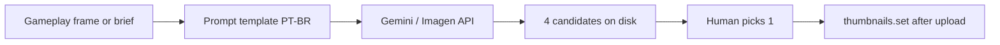

# Thumbnails workflow — YouTube (manual today, automation later)

> **EN + PT** · Custom thumbnails for [@abobicaduco](https://www.youtube.com/@abobicaduco) long-form and Shorts.  
> **No API keys or tokens in this repo.**

Related: [content/FORTNITE_MOBILE.md](content/FORTNITE_MOBILE.md) · [youtube/HANDOFF.md](youtube/HANDOFF.md) · [PLATFORMS.md](PLATFORMS.md)

---

## Current workflow (manual, Gemini paid)

1. After gameplay is recorded and batch files exist in inbox, open **Google Gemini** (paid tier) in the browser.
2. Generate **4 thumbnail variants** per video (or per batch day).
3. **Human review** — pick the best variant; adjust text/contrast if needed.
4. Export **1280×720** JPEG (YouTube custom thumbnail safe zone).
5. Save next to the batch (see naming below).
6. After upload, pipeline can call **YouTube Data API** `thumbnails.set` when `thumb_path` is set (see [API flow](#youtube-api-flow-conceptual)).

**Publish gate:** do not schedule/publich until the approved thumbnail file exists on disk (or you explicitly accept the YouTube auto-frame).

---

## File naming and folder

| Item | Convention |
|------|------------|
| **Folder** | `%USERPROFILE%\YOUTUBE\inbox\<batch_id>\thumbnails\` (sibling to MP4s and `manifest.csv`) |
| **Pattern** | `<batch_prefix>_<NN>_thumb.jpg` |
| **Example** | `fortnite_mobile_01_thumb.jpg` … `fortnite_mobile_04_thumb.jpg` |

Fortnite batch (`fortnite_mobile_20260530`):

```
inbox/fortnite_mobile_20260530/
├── fortnite_mobile_01.mp4
├── thumbnails/
│   ├── fortnite_mobile_01_thumb.jpg
│   └── …
├── batch.yaml
└── manifest.csv
```

**Optional batch default:** `thumbnail:` key in `batch.yaml` (see `scripts/youtube/templates/batch.example.yaml`).

**Per-clip override:** `thumb_path` / `thumbnail` column in manifest or `clips_metadata.json` (resolved in `scripts/youtube/manifest.py`).

---

## YouTube API flow (conceptual)

1. `videos.insert` — upload video (private until `publishAt` if scheduled).
2. `thumbnails.set` — upload JPEG/PNG with OAuth scope that includes YouTube upload access.
3. Implementation: `YouTubeUploader.set_thumbnail()` in `scripts/youtube/uploader.py` (retries on transient errors; upload still succeeds if thumb fails).

**Requirements (Google policy):**

- Channel verified for custom thumbnails (subscriber threshold).
- Image ≤ 2 MB, JPG/PNG, recommended **1280×720**.

**No credentials here** — OAuth token lives only under `%USERPROFILE%\.secrets\youtube_token.json` (gitignored).

---

## Wiring thumbnails into upload

| Method | How |
|--------|-----|
| **batch.yaml** | `thumbnail: "%USERPROFILE%/YOUTUBE/inbox/.../thumbnails/fortnite_mobile_01_thumb.jpg"` |
| **manifest.csv** | Add column or use metadata JSON with `thumb_path` per file |
| **Pipeline** | `ClipEntry.thumb_path` passed to uploader after `videos.insert` |

Dry-run logs `[DRY-RUN] Would set thumbnail: …` when path is valid.

---

## Future automation (architecture only)

**Goal:** generate candidate thumbnails via **Gemini** or **Imagen** using the same Google account, then keep the **human review** step before publish.



| Piece | Status |
|-------|--------|
| Frame grab (ffmpeg) | Not implemented — optional first frame @ 5s |
| Prompt + brand rules | Documented below (template) |
| API client | Future script under `scripts/shared/` or `scripts/youtube/` |
| Secrets | Store key in **local secrets file only** — never commit |

### API key storage (placeholder)

Follow the same pattern as other tools on this machine:

- **Canonical reference doc:** `AI_CREDENTIALS.md` (user home — lists *where* keys live, not values).
- **Local JSON:** `%USERPROFILE%\.secrets\api-keys.json` — e.g. `custom.google_gemini.api_key` = `YOUR_API_KEY`.
- **Env override:** `GEMINI_API_KEY` or project-specific name in `scripts/.env` (gitignored).

Agents: **never** read or paste `api-keys.json` / `youtube_token.json` into chat or commits.

---

## Suggested prompt template (Fortnite Mobile, PT-BR, 1280×720)

Use as a **structure** — replace `{episode}`, `{hook}`, `{brand}`:

```text
Crie uma thumbnail de YouTube 1280x720 para gameplay de Fortnite Mobile.

Canal: {brand} (@abobicaduco)
Episódio: {episode}
Estilo: alto contraste, texto grande em português (máx. 4 palavras), rosto/personagem em destaque, fundo borrado do gameplay.
Cores: roxo/azul neon + amarelo para CTA.
Proibido: logos oficiais da Epic, blood/gore, texto ilegível, mais de 3 linhas de texto.
Entregue 4 variações com hooks diferentes: {hook}
```

**Human review checklist:**

- [ ] Text readable at mobile size  
- [ ] No trademark violations  
- [ ] Matches video title/topic  
- [ ] File name matches `fortnite_mobile_NN_thumb.jpg`  
- [ ] Approved file in `thumbnails/` before upload run  

---

## Security

| Never commit | Notes |
|--------------|--------|
| `youtube_token.json`, `youtube_client_secret.json` | OAuth |
| `api-keys.json` | Gemini / other APIs |
| `*.db` | Schedule state |
| Full-size thumbnail exports with personal email/watermarks | Optional `.gitignore` under inbox if syncing folder |

Use `%USERPROFILE%` and `~/.secrets/` in docs — not machine-specific drive letters except as examples in LOCAL_SETUP.

---

*Last updated: 2026-05-30*
