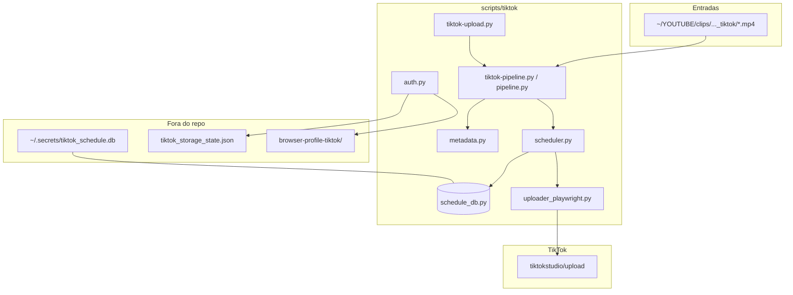

# TikTok automation — AI handoff / Continuidade para agentes

> **Single source of truth** for TikTok upload automation in this repo.  
> **Fonte única** para continuar uploads TikTok (@abobicaduco).

**When switching agents:** paste **[PLATFORMS.md](../PLATFORMS.md)** + **this file** + [SCHEDULING_POLICY.md](SCHEDULING_POLICY.md) + [YouTube HANDOFF](../youtube/HANDOFF.md) (shared clips folder).

> **Policy guard:** [SCHEDULING_POLICY.md](SCHEDULING_POLICY.md) — **3 vídeos/dia** (16/18/21 SP), SQLite separado do YouTube.

---

## Português (Brasil)

### Changelog / log de sessão

| Data | O que foi feito |
|------|-----------------|
| 2026-05-29 | **Ollama metadata:** captions via `scripts/shared/llm_metadata.py` + `clips_metadata.json`; flags `--use-llm` / `--no-llm` / `--pre-generate-metadata` no pipeline |
| 2026-05-29 | **Upload batch:** 3 clipes enviados (#000–#002); clip #050 dedup `uploaded` + `tiktok-1780090360`; **4 uploaded / 47 pending** no DB; toggle agendamento UI ausente → publicação imediata |
| 2026-05-29 | Módulo `scripts/tiktok/` criado: Playwright upload, SQLite `tiktok_schedule.db`, pipeline 3/dia, docs HANDOFF + SCHEDULING_POLICY |
| 2026-05-29 | Abordagem escolhida: **Playwright** (API oficial exige audit; sandbox só post privado) |
| 2026-05-29 | Metadados PT-BR: título + hook + hashtags **só na caixa de descrição** (padrão TikTok) |
| 2026-05-29 | Clipes fonte: `~/YOUTUBE/clips/abobicaduco_jogando_Granny_2_-_Parte_#2_tiktok/` (51 MP4, mesmo split do YouTube) |
| 2026-05-29 | `--auth-only`: fecha abas restauradas, `goto` login uma vez, `input()` bloqueante; `ensure_session` nao navega mais para upload |
| 2026-05-29 | **Upload padrao = Schedule UI** (Agendar/Programar); `--post-now` opt-in; falha se toggle/data/hora nao encontrados |
| 2026-05-29 | Excecao: `clip_..._050.mp4` publicado imediatamente em teste antigo — DB `uploaded`; demais usam agendamento |

### Abordagem (pesquisa honesta)

| Opção | Custo | Viabilidade agora | Notas |
|-------|-------|-------------------|-------|
| **TikTok Content Posting API v2** | Grátis | ⏳ Requer app + OAuth + **audit** | Sandbox: posts `SELF_ONLY` (privado), máx. ~5 users; audit 1–2 semanas; direct post ~6 req/min |
| **APIs não oficiais** | Variável | ❌ Evitar | Risco ToS, ban, instabilidade — **não usar** |
| **Playwright (web upload)** | Grátis | ✅ Implementado | Login manual 1×; sujeito a CAPTCHA/UI; agendamento via UI quando disponível |

**Decisão:** Playwright primeiro. API documentada em `uploader_api.py` para quando audit passar.

### Status do projeto

| Item | Valor |
|------|--------|
| Canal | [@abobicaduco](https://www.tiktok.com/@abobicaduco) (handle site: `@abobicaducoo` em links page) |
| Método upload | Playwright → `tiktok.com/tiktokstudio/upload` |
| Entry points | `python scripts/tiktok-upload.py` · `python scripts/tiktok-pipeline.py` |
| Python | 3.12+ |
| Playwright | `pip install playwright` + `playwright install chromium` (usa `channel=chrome`) |
| SQLite | `%USERPROFILE%\.secrets\tiktok_schedule.db` (separado do YouTube) |
| Sessão | `scripts/browser-profile-tiktok/` + `%USERPROFILE%\.secrets\tiktok_storage_state.json` |
| Limite editorial | **3 vídeos/dia** (16h, 18h, 21h America/Sao_Paulo) |

### Arquitetura



### Mapa de pastas

```
scripts/
  tiktok-upload.py           # launcher CLI
  tiktok-pipeline.py         # launcher pipeline
  browser-profile-tiktok/    # perfil Chrome (gitignored)
  tiktok/
    pipeline.py              # CLI principal
    auth.py                  # --auth-only login
    uploader_playwright.py   # upload web
    uploader_api.py          # stub API oficial
    schedule_db.py           # SQLite
    scheduler.py             # slots 16/18/21
    metadata.py              # caption PT-BR
    config.py
docs/tiktok/
  HANDOFF.md                 # este arquivo
  SCHEDULING_POLICY.md       # regra 3/dia
```

### Formato da descrição (caption)

Título e hashtags vão **somente** na caixa de descrição do TikTok:

```
{linha de titulo chamativa}

{hook PT-BR}

#abobicaduco #granny2 #gameplay #horror #terror #susto #jogodeterro
```

Gerado por `metadata.py` reutilizando hooks do `youtube/video_splitter.py`.

### Estado atual (2026-05-29)

| Métrica | Valor |
|---------|-------|
| Total clipes | 51 |
| `uploaded` | **4** (#050 manual + #000–#002 batch) |
| `pending` | **47** |
| Range de slots | 2026-05-30 → 2026-06-15 |
| Dedup #050 | `post_id=tiktok-1780090360`, status `uploaded` |

**Nota:** toggle de agendamento na UI TikTok não encontrado — uploads vão como publicação imediata até ajuste em `uploader_playwright.py`.

### Comandos CLI

**1. Login (obrigatório na 1ª vez — browser visível, CAPTCHA/QR manual):**

Fecha **todas** as janelas Chrome/TikTok antes de rodar. O script abre `tiktok.com/login` **uma única vez** e **não recarrega** a página enquanto você escaneia o QR (aguarda até 5 minutos). Ao detectar sessão, grava:

- `~/.secrets/tiktok_storage_state.json`
- perfil persistente em `scripts/browser-profile-tiktok/` (ou `TIKTOK_BROWSER_PROFILE`)

```powershell
cd C:\Users\carlo\Projects\abobi-shorts-upload-pipeline
python scripts/tiktok-upload.py --auth-only
```

**2. Teste — um upload real (agenda no slot do DB por padrao):**

```powershell
python scripts/tiktok-upload.py --test-upload "C:\Users\carlo\YOUTUBE\clips\abobicaduco_jogando_Granny_2_-_Parte_#2_tiktok\clip_abobicaduco jogando Granny 2 - Parte 2 tiktok_003.mp4"
```

Dry-run (sem browser):

```powershell
python scripts/tiktok-upload.py --test-upload "...\clip_..._003.mp4" --dry-run
```

Publicar imediatamente (excecao — requer flag explicita):

```powershell
python scripts/tiktok-upload.py --test-upload "...\clip.mp4" --post-now
```

**Nota:** `clip_..._050.mp4` foi publicado imediatamente num teste anterior; esta `uploaded` no DB. Nao reenviar.

**3. Planejar 51 clipes no SQLite (sem upload):**

```powershell
python scripts/tiktok-pipeline.py --schedule-only --clips-dir "C:\Users\carlo\YOUTUBE\clips\abobicaduco_jogando_Granny_2_-_Parte_#2_tiktok"
```

**4. Agendar em lote via UI (max 3 por execucao — politica):**

```powershell
python scripts/tiktok-pipeline.py --resume --upload-limit 3
```

Cada execucao abre TikTok Studio, preenche caption e usa **Schedule/Agendar** com data/hora do slot SQLite. Status DB vira `scheduled`.

Repetir diariamente ou usar `--until-done` (cuidado: UI TikTok pode limitar sessao).

**5. Verificar DB:**

```powershell
sqlite3 $env:USERPROFILE\.secrets\tiktok_schedule.db "SELECT status, COUNT(*) FROM scheduled_uploads GROUP BY status;"
```

### TikTok Content Posting API — passos se quiser migrar depois

1. Criar app em [developers.tiktok.com](https://developers.tiktok.com/) → adicionar **Content Posting API**.
2. Pedir scopes `video.publish` (direct post) e/ou `video.upload` (inbox).
3. OAuth redirect **HTTPS público** (TikTok rejeita localhost puro).
4. Sandbox: posts forçados **privados** (`SELF_ONLY`) até audit.
5. Submeter audit: privacy policy, landing page, vídeo demo do fluxo, UX com seletor de privacidade pelo usuário.
6. Rate limit: ~6 requests/min por access_token; cap diário por creator (~15 posts/dia compartilhado entre apps).
7. Implementar em `uploader_api.py` quando aprovado.

### Riscos e limites

- **ToS:** automação web não é oficial; use conta pessoal com moderação; pare se TikTok bloquear.
- **CAPTCHA / login:** Playwright exige `--auth-only` manual; sessão expira — refaça login se upload falhar.
- **Agendamento UI:** selectors em `uploader_playwright.py` (Schedule/Agendar/Programar, data/hora). Se falhar, script aborta — **nao** faz fallback para Post. Ajuste selectors ou use `--post-now` so em teste.
- **3/dia:** enforced no SQLite (mesma filosofia YouTube); TikTok platform pode ter limite próprio adicional.
- **1Password / workspace:** se scripts de senha abrirem vault errado, use workspace **abobiferramentas** (não Home pessoal). Não há script 1Password neste repo — só nota operacional.

### .gitignore

Já coberto: `scripts/browser-profile-tiktok/`, `*.db`, `**/.secrets/`, `tiktok_storage_state.json` via padrões globais.

---

## English

### Summary

TikTok upload automation mirrors the YouTube Shorts pipeline: **max 3 videos/day** at 16:00 / 18:00 / 21:00 `America/Sao_Paulo`, separate SQLite at `~/.secrets/tiktok_schedule.db`, PT-BR captions (title + hook + hashtags in description only).

**Default upload:** TikTok Creator Center **Schedule** UI (not immediate post). Pass `--post-now` to publish now.

**Approach:** Playwright web upload (free). Official Content Posting API v2 is free but needs developer app audit before public posts; sandbox is private-only.

### Quick start

```powershell
python scripts/tiktok-upload.py --auth-only
python scripts/tiktok-upload.py --test-upload path\to\clip.mp4          # schedules by default
python scripts/tiktok-upload.py --test-upload path\to\clip.mp4 --dry-run
python scripts/tiktok-pipeline.py --schedule-only
python scripts/tiktok-pipeline.py --resume --upload-limit 3
```

See [SCHEDULING_POLICY.md](SCHEDULING_POLICY.md) for slot rules and resume commands.
