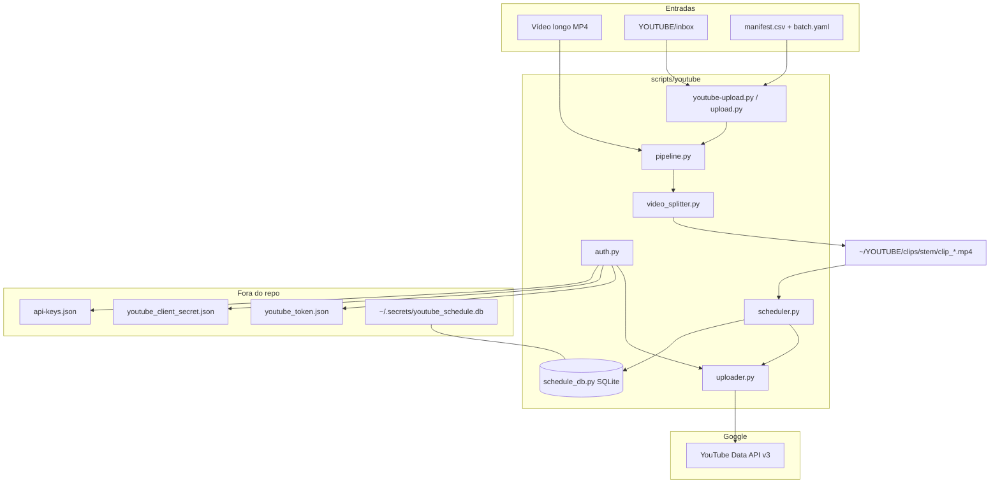

# YouTube automation — AI handoff / Continuidade para agentes

> **Single source of truth** for continuing this subproject in **Cursor**, **Claude**, **Google Antigravity**, or any coding agent.  
> **Fonte única** para continuar este subprojeto em qualquer agente de código.

**When switching agents:** paste **[PLATFORMS.md](../PLATFORMS.md)** + **this file** + [SCHEDULING_POLICY.md](SCHEDULING_POLICY.md) + [TikTok HANDOFF](../tiktok/HANDOFF.md) + [README.en.md](../../scripts/youtube/README.en.md) (or [README.pt-BR](../../README.pt-BR.md) for PT).

> **Policy guard:** [SCHEDULING_POLICY.md](SCHEDULING_POLICY.md) — 3 Shorts/dia (16/18/21 SP), SQLite source of truth, comando AMANHÃ, quota rules.

---

## Português (Brasil)

### Changelog / log de sessão

| Data | O que foi feito |
|------|-----------------|
| 2026-05-30 | **Fortnite Mobile long-form (4 vídeos):** inbox `~/YOUTUBE/inbox/fortnite_mobile_20260530/` + `batch.yaml` + `manifest.csv`; slot longo **19:00** SP (1/dia); 4 uploads agendados (`KlmXPQi1aCA`, `kw0FXbwlSEY`, `LaW_ah7WftM`, `bVVnwSipiUk`); TikTok em `pending_tiktok/fortnite_mobile` (cap 30 scheduled); script `scripts/fortnite_long_batch.py` |
| 2026-05-30 | **audit_and_schedule.py:** audita canal abobicaduco — lista uploads, corrige metadados SEO (template/LLM), agenda private sem publishAt; unlisted = só metadados (publishAt impossível); skip video_id já no SQLite; launcher `youtube-audit.py` + flag `--audit-schedule` |
| 2026-05-30 | **Execução live:** 125 vídeos no canal; 32 metadados atualizados; 31 private agendados (#53–#83, slots 16/18/21 após pipeline #01–#51); 1 unlisted metadata-only (`hljPp54CAsM`); 0 falhas |
| 2026-05-29 | **Ollama metadata:** `scripts/shared/llm_metadata.py` — títulos/descrições/hashtags/tags PT-BR via Llama local; fallback template; `clips_metadata.json`; flags `--use-llm` / `--no-llm` / `--pre-generate-metadata` |
| 2026-05-29 | **Docs unificados:** `docs/PLATFORMS.md`, `LOCAL_SETUP.md`, README Platforms section; TikTok 4/51 uploaded |
| 2026-05-29 | **[SCHEDULING_POLICY.md](SCHEDULING_POLICY.md):** regras 3 Shorts/dia (16/18/21 SP) + 1 longo/dia (planejado); guard para agentes; bloco **AMANHÃ** com `--resume --upload-limit 6 --until-done`; estado 45/51 + 6 pending |
| 2026-05-29 | **Granny 2 Parte #2 — upload em massa:** 33 clipes enviados nesta sessão (`--resume --upload-limit 6 --until-done`); **45/51 agendados** no YouTube (slots 16h/18h/21h BRT); **6 pendentes** (#46–#51) — parou em `uploadLimitExceeded` |
| 2026-05-29 | Metadados PT-BR melhorados: títulos Granny 2 com hooks únicos (#01–#51), descrições com CTA + hashtags `#abobicaduco #granny2 #horror #terror #shorts`; tags `horror`, `survival`, `terror` |
| 2026-05-29 | Pipeline: `--refresh-metadata`, `--until-done`, `--source-stem`; `resume` sem `--split-input`; detecção de quota YouTube |
| 2026-05-29 | OAuth Desktop testado (`--auth-only`); upload real OK |
| 2026-05-29 | Vídeo de teste publicado: `hljPp54CAsM` (unlisted) no canal [abobicaduco](https://www.youtube.com/@abobicaduco) |
| 2026-05-29 | Inbox padrão migrado para `%USERPROFILE%\YOUTUBE\inbox` (antes algumas máquinas usavam `E:/YOUTUBE/inbox`) |
| 2026-05-29 | Pipeline **split + schedule + upload** implementado: `video_splitter.py`, `scheduler.py`, `schedule_db.py`, `pipeline.py`, launcher `youtube-pipeline.py` |
| 2026-05-29 | SQLite em `~/.secrets/youtube_schedule.db` — slots 16h / 18h / 21h (America/Sao_Paulo) |
| 2026-05-29 | Integração `--pipeline` / `--resume` no CLI principal `youtube-upload.py` |
| 2026-05-29 | Docs GitHub-ready: HANDOFF, README EN/PT, MIT LICENSE, `.gitignore` ampliado |

> **Pipeline em produção:** 6 clipes prontos para upload amanhã — ver [SCHEDULING_POLICY.md](SCHEDULING_POLICY.md). Rodar `--dry-run` em fluxos novos.

### ▶ AMANHÃ — retomar os 6 pendentes

> **Atualização 2026-05-30:** Os 6 pendentes originais (#46–#51) foram concluídos. Novos 31 private órfãos foram auditados e agendados (#53–#83). Ver seção **Channel audit** abaixo.

```powershell
cd C:\Users\carlo\Projects\abobi-shorts-upload-pipeline
python scripts/youtube-pipeline.py --resume --upload-limit 6 --until-done
```

Verificar após sucesso: `pending=0` (detalhes em [SCHEDULING_POLICY.md](SCHEDULING_POLICY.md)).

### Channel audit (`audit_and_schedule.py`)

Corrige vídeos **unlisted** (só metadados) e **private sem publishAt** (metadados + agendamento).

**Limitação YouTube:** vídeos **unlisted já publicados** aceitam `videos.update` em snippet (title, description, tags), mas **não** aceitam `status.publishAt` futuro para virar public scheduled. Para agendar publicação, o vídeo precisa estar **private** (ou ser re-upload).

```powershell
# Dry-run (sem writes)
python scripts/youtube-audit.py --dry-run --no-llm

# Execução real
python scripts/youtube-audit.py --no-llm

# Via CLI principal
python scripts/youtube-upload.py --audit-schedule --dry-run

# LLM local (Ollama) — mais lento; fallback template se offline
python scripts/youtube-audit.py --use-llm
```

| Flag | Efeito |
|------|--------|
| `--dry-run` | Lista ações sem chamar API de escrita |
| `--no-llm` | Metadados via template (rápido, padrão no audit) |
| `--use-llm` | Ollama via `llm_metadata.py` |
| `--all-videos` | Ignora filtro de título Granny/abobicaduco |
| `--limit N` | Processa no máximo N alvos |
| `--db PATH` | SQLite custom (default `~/.secrets/youtube_schedule.db`) |

**Classificação de alvos:**

| privacyStatus | publishAt | Ação |
|---------------|-----------|------|
| `private` | ausente ou passado | metadata + schedule (16/18/21 SP) |
| `private` | futuro | skip (já agendado no YouTube) |
| `unlisted` | n/a | metadata only |
| `public` | n/a | skip |
| qualquer | video_id no SQLite | skip |

**Última execução (2026-05-30):** 125 total · 51 skip DB · 42 skip outros · 32 metadata · 31 scheduled · 1 unlisted-only · 0 failed · range publicação 2026-05-22..2026-05-30 · slots novos 2026-06-15..2026-06-25 (SP).

### Status do projeto

| Item | Valor |
|------|--------|
| OAuth | Testado OK (`--auth-only` e upload real) |
| Canal | [abobicaduco](https://www.youtube.com/@abobicaduco) |
| Vídeo de teste | `hljPp54CAsM` (unlisted) |
| Entry points | `python scripts/youtube-upload.py` · `python scripts/youtube-pipeline.py` |
| Python | 3.12+ |
| ffmpeg | PATH, `FFMPEG_PATH`, ou pacote `imageio-ffmpeg` |
| API | YouTube Data API v3 — escopos `youtube.upload` + `youtube` |
| Slots padrão | 16:00, 18:00, 21:00 (`America/Sao_Paulo`) |
| Quota | ~6 uploads/dia (conta nova); pipeline limita a 3/run por padrão |

### Arquitetura



### Mapa de pastas

**No repositório (`abobi-shorts-upload-pipeline`):**

```
scripts/
  youtube-upload.py          # launcher upload + flags --pipeline
  youtube-audit.py             # launcher channel audit
  youtube-pipeline.py          # launcher dedicado ao pipeline
  .env.example                 # vars gerais (bloco YouTube comentado)
  youtube/
    upload.py                  # CLI principal (inbox, single, pipeline)
    pipeline.py                # split → plan → schedule → upload
    video_splitter.py          # ffmpeg → clip_*.mp4
    scheduler.py               # slots + publishAt
    schedule_db.py             # SQLite schema + occupancy
    auth.py                    # OAuth + refresh
    config.py                  # paths, inbox, batch defaults
    uploader.py                # upload resumable + thumb + playlist
    manifest.py                # CSV + YAML
    watcher.py                 # --inbox --watch
    audit_and_schedule.py      # channel audit + metadata fix + schedule private
    secrets_store.py           # merge em api-keys.json
    stdio.py                   # UTF-8 console Windows
    requirements.txt
    .env.example
    README.md / README.en.md
    templates/
      manifest.example.csv
      batch.example.yaml
docs/youtube/
  HANDOFF.md                   # este arquivo
  SCHEDULING_POLICY.md         # regras de publicação + guard agentes + comando AMANHÃ
  SCHEDULER.md                 # detalhes do agendador + SQLite
AGENTS.md                      # ponte GitHub/Cursor → HANDOFF
```

**Fora do repositório (NUNCA commitar):**

```
%USERPROFILE%\.secrets\
  api-keys.json                # chave google_oauth_youtube
  youtube_schedule.db          # slots agendados (pipeline)
  scripts\
    youtube_client_secret.json # fallback OAuth Desktop JSON
    youtube_token.json         # fallback token

%USERPROFILE%\YOUTUBE\
  inbox\                       # inbox padrão (override: YOUTUBE_INBOX)
    manifest.csv
    batch.yaml
    *.mp4
    uploaded\
  clips\<stem>\                # saída do split (clip_*.mp4)
```

### Mapa de secrets (NOMES e CAMINHOS — nunca valores)

#### `~/.secrets/api-keys.json` → `google_oauth_youtube`

| Campo | Descrição |
|-------|-----------|
| `client_secret_json` | Objeto JSON OAuth Desktop **ou** caminho para `.json` |
| `client_id` | Alternativa ao JSON embutido |
| `client_secret` | Alternativa ao JSON embutido |
| `project_id` | ID do projeto Google Cloud |
| `refresh_token` | Preenchido após `--auth-only` |
| `token_uri` | Default: `https://oauth2.googleapis.com/token` |
| `scopes` | Lista; default inclui youtube.upload |
| `token` | Access token (refresh automático) |
| `token_saved_at` | ISO UTC; gravado no merge |

Exemplo **estrutural** (sem segredos):

```json
{
  "google_oauth_youtube": {
    "client_secret_json": {
      "installed": {
        "client_id": "YOUR_CLIENT_ID.apps.googleusercontent.com",
        "client_secret": "YOUR_CLIENT_SECRET",
        "project_id": "your-gcp-project",
        "auth_uri": "https://accounts.google.com/o/oauth2/auth",
        "token_uri": "https://oauth2.googleapis.com/token",
        "redirect_uris": ["http://localhost"]
      }
    }
  }
}
```

#### Arquivos fallback

| Arquivo | Conteúdo |
|---------|----------|
| `~/.secrets/scripts/youtube_client_secret.json` | Download OAuth Desktop do Google Cloud |
| `~/.secrets/scripts/youtube_token.json` | Token OAuth após login |
| `~/.secrets/youtube_schedule.db` | SQLite do pipeline (slots + status) |

#### Variáveis de ambiente (nomes)

| Variável | Uso |
|----------|-----|
| `YOUTUBE_INBOX` | Pasta inbox |
| `YOUTUBE_UPLOADED_DIR` | Destino pós-upload |
| `YOUTUBE_CLIENT_SECRETS` | Caminho OAuth JSON |
| `YOUTUBE_TOKEN_PATH` | Caminho token JSON |
| `FFMPEG_PATH` | Executável ffmpeg (opcional) |

### Ordem de resolução de credenciais

**Client secret:** `YOUTUBE_CLIENT_SECRETS` → api-keys `google_oauth_youtube` → `~/.secrets/scripts/youtube_client_secret.json` → `scripts/youtube/.secrets/client_secret.json` → legado adsense → único `client_secret*.json` em Downloads.

**Token:** api-keys `refresh_token` → `YOUTUBE_TOKEN_PATH` → `~/.secrets/scripts/youtube_token.json` → `scripts/youtube/.secrets/token.json`.

### Cheat sheet — todos os comandos

```powershell
cd C:\Users\carlo\Projects\abobi-shorts-upload-pipeline
pip install -r scripts/youtube/requirements.txt

# Validar sintaxe
python -m py_compile scripts/youtube/*.py scripts/youtube-upload.py scripts/youtube-pipeline.py

# OAuth (primeira vez ou renovar escopos)
python scripts/youtube-upload.py --auth-only

# --- Inbox batch ---
python scripts/youtube-upload.py --inbox
python scripts/youtube-upload.py --inbox --dry-run
python scripts/youtube-upload.py --inbox --watch

# --- Um vídeo ---
python scripts/youtube-upload.py clip.mp4 --title "Titulo" --description "Texto"

# --- Manifest customizado ---
python scripts/youtube-upload.py --manifest path\manifest.csv --batch path\batch.yaml

# --- Pipeline: split + agendar + upload ---
python scripts/youtube-upload.py --pipeline --split-input "D:\Videos\live_granny.mp4" --dry-run
python scripts/youtube-upload.py --pipeline --split-input "D:\Videos\live_granny.mp4" --upload-limit 3
python scripts/youtube-upload.py --pipeline --split-input "D:\Videos\live_granny.mp4" --upload-all

# Mesmo pipeline via launcher dedicado
python scripts/youtube-pipeline.py --split-input "D:\Videos\live_granny.mp4" --dry-run

# Só re-agendar clips já cortados
python scripts/youtube-upload.py --pipeline --split-input "D:\Videos\live_granny.mp4" --schedule-only

# Retomar pending/failed no SQLite (sem split)
python scripts/youtube-upload.py --pipeline --resume
python scripts/youtube-upload.py --pipeline --resume --upload-limit 3

# Slots customizados + data inicial
python scripts/youtube-pipeline.py --split-input live.mp4 --slots "16,18,21" --start-date 2026-06-01 --timezone America/Sao_Paulo

# DB customizado
python scripts/youtube-pipeline.py --split-input live.mp4 --db C:\Users\carlo\.secrets\youtube_schedule.db --dry-run
```

### Workflow split + schedule + upload

1. **Split** — `video_splitter.py` corta o MP4 em `~/YOUTUBE/clips/<stem>/clip_*.mp4` via ffmpeg (~50 clips default).
2. **Plan** — `scheduler.plan_uploads()` aloca próximos slots livres (16/18/21 SP) consultando SQLite.
3. **Persist** — cada clip vira row `pending` em `scheduled_uploads`.
4. **Upload** — `uploader.upload_video(..., publish_at=utc)` envia como **private** com `publishAt` futuro.
5. **Status** — `scheduled` + `video_id` após sucesso; `failed` com retry até 3x.
6. **Quota** — default **3 uploads/run**; use `--upload-all` ou `--resume` nos dias seguintes.

### SQLite — schema e consultas

**Arquivo:** `%USERPROFILE%\.secrets\youtube_schedule.db` (override: `--db`)

**Tabela `scheduled_uploads`:**

| Coluna | Tipo | Descrição |
|--------|------|-----------|
| `id` | INTEGER PK | Auto |
| `file_path` | TEXT UNIQUE | Caminho absoluto do clip |
| `video_id` | TEXT | ID YouTube após upload |
| `title` | TEXT | Título gerado |
| `scheduled_at_utc` | TEXT ISO | Horário publish UTC |
| `slot_date` | TEXT | `YYYY-MM-DD` local |
| `slot_hour` | INTEGER | 16, 18 ou 21 |
| `status` | TEXT | `pending` · `uploading` · `scheduled` · `uploaded` · `failed` |
| `created_at` | TEXT ISO | Criação |
| `retry_count` | INTEGER | Tentativas |
| `last_error` | TEXT | Último erro |

**View `daily_slot_occupancy`:** flags `hour_16`, `hour_18`, `hour_21` por dia.

**Consultar slots livres (PowerShell + sqlite3):**

```powershell
sqlite3 $env:USERPROFILE\.secrets\youtube_schedule.db "SELECT slot_date, hour_16, hour_18, hour_21 FROM daily_slot_occupancy ORDER BY slot_date DESC LIMIT 14;"
```

**Resumo por status:**

```powershell
sqlite3 $env:USERPROFILE\.secrets\youtube_schedule.db "SELECT status, COUNT(*) FROM scheduled_uploads GROUP BY status;"
```

**Próximos agendamentos:**

```powershell
sqlite3 $env:USERPROFILE\.secrets\youtube_schedule.db "SELECT slot_date, slot_hour, title, status FROM scheduled_uploads WHERE status IN ('pending','scheduled') ORDER BY scheduled_at_utc LIMIT 20;"
```

Slot livre = hora do dia **sem** row com status em `pending|uploading|scheduled|uploaded` (lógica em `ScheduleDB.is_slot_taken`).

### manifest.csv + batch.yaml

Copiar de `scripts/youtube/templates/`. Ver [SCHEDULER.md](SCHEDULER.md) para defaults do pipeline Granny 2.

### .gitignore relevante

- `**/.secrets/`, `**/client_secret*.json`, `**/youtube_token.json`, `**/api-keys.json`
- `.env`, `.env.*` (exceto `.env.example`)
- `*.db`, `*.sqlite` (inclui `youtube_schedule.db` se copiado por engano)
- `YOUTUBE/`, `uploaded/`, `__pycache__/`

### Checklist antes do primeiro push no GitHub

- [ ] `git status` — nenhum `.env`, `client_secret*.json`, `youtube_token.json`, `api-keys.json`, `*.db`
- [ ] `rg "AIzaSy|GOCSPX-|refresh_token.*1//" .` — zero matches com valores reais
- [ ] Rotacionar OAuth no Google Cloud se credencial vazou em chat/commit antigo
- [ ] `LICENSE` (MIT) na raiz
- [ ] Smoke: `python -m py_compile scripts/youtube/*.py` e `python scripts/youtube-upload.py --help`
- [ ] README EN + PT sem segredos; HANDOFF com placeholders apenas
- [ ] Não commitar `%USERPROFILE%\.secrets\` nem conteúdo de `YOUTUBE/`

### Como continuar com Claude / Antigravity / Cursor

1. Abrir repo localmente.
2. Colar no chat: **este HANDOFF.md** + **[SCHEDULING_POLICY.md](SCHEDULING_POLICY.md)** + [README.en.md](../../scripts/youtube/README.en.md).
3. Descrever tarefa (ex.: "rodar pipeline dry-run", "fix quota", "thumbnail default").
4. Agente lê `~/.secrets/api-keys.json` **localmente** — nunca commitar.
5. Sempre testar com `--dry-run` antes de upload real.
6. **Nunca mais de 3 Shorts/dia** nos slots 16/18/21 — ver [SCHEDULING_POLICY.md](SCHEDULING_POLICY.md).
7. Pipeline completo: ver [SCHEDULER.md](SCHEDULER.md).

---

## English (US)

### Changelog / session log

| Date | What changed |
|------|----------------|
| 2026-05-30 | **audit_and_schedule.py:** channel audit for abobicaduco — metadata fix + schedule orphan private videos; unlisted = metadata-only; skip IDs in SQLite; `youtube-audit.py` launcher |
| 2026-05-30 | **Live run:** 125 channel videos; 32 metadata updated; 31 private scheduled (#53–#83); 1 unlisted metadata-only; 0 failures |
| 2026-05-29 | **[SCHEDULING_POLICY.md](SCHEDULING_POLICY.md):** 3 Shorts/day policy, AI guard rails, TOMORROW resume command, 45/51 + 6 pending |
| 2026-05-29 | **Granny 2 Part #2 bulk upload:** 33 clips uploaded this session; **45/51 scheduled** on YouTube; **6 pending** (#46–#51) — stopped at `uploadLimitExceeded` |
| 2026-05-29 | Improved PT-BR metadata; pipeline flags `--refresh-metadata`, `--until-done`, quota detection |
| 2026-05-29 | OAuth Desktop verified; real upload OK |
| 2026-05-29 | Test video `hljPp54CAsM` (unlisted) on [abobicaduco](https://www.youtube.com/@abobicaduco) |
| 2026-05-29 | Default inbox `%USERPROFILE%\YOUTUBE\inbox` (some machines used `E:/YOUTUBE/inbox`) |
| 2026-05-29 | **Split + schedule + upload** pipeline: `video_splitter`, `scheduler`, `schedule_db`, `pipeline`, `youtube-pipeline.py` |
| 2026-05-29 | SQLite at `~/.secrets/youtube_schedule.db` — slots 4pm / 6pm / 9pm São Paulo |
| 2026-05-29 | `--pipeline` / `--resume` integrated into main CLI |
| 2026-05-29 | GitHub-ready docs, MIT license, expanded `.gitignore` |

> **Production pipeline:** 6 clips ready for tomorrow's resume — see [SCHEDULING_POLICY.md](SCHEDULING_POLICY.md).

### TOMORROW — resume 6 pending clips

```powershell
cd C:\Users\carlo\Projects\abobi-shorts-upload-pipeline
python scripts/youtube-pipeline.py --resume --upload-limit 6 --until-done
```

Verify: `pending=0` — details in [SCHEDULING_POLICY.md](SCHEDULING_POLICY.md).

### Project status

Same table as PT section. Entry points: `scripts/youtube-upload.py`, `scripts/youtube-pipeline.py`.

### Architecture

See mermaid diagram in PT section (split → SQLite slots → YouTube `publishAt`).

### Secrets map

Field names and paths only — see PT tables. Never paste real `client_secret`, `refresh_token`, or API keys into git or chat logs.

### Full CLI

Same commands as PT cheat sheet. Key pipeline flags:

| Flag | Purpose |
|------|---------|
| `--pipeline` | Enable split + schedule flow |
| `--split-input` | Source MP4 (required unless `--resume`) |
| `--dry-run` | Plan only, no API upload |
| `--schedule-only` | Skip split; use existing clips |
| `--resume` | Retry pending/failed from SQLite |
| `--upload-limit N` | Cap uploads this run (default 3) |
| `--upload-all` | Upload all planned clips (quota!) |
| `--slots "16,18,21"` | Local publish hours |
| `--db PATH` | Custom SQLite path |
| `--use-llm` / `--no-llm` | Force Ollama metadata or template-only |
| `--pre-generate-metadata` | Write `clips_metadata.json` in clips folder |
| `--metadata-manifest PATH` | Use pre-generated JSON manifest |
| `--refresh-metadata` | Regenerate pending titles/descriptions |

### SQLite

Database: `~/.secrets/youtube_schedule.db`. Table `scheduled_uploads` + view `daily_slot_occupancy`. Query examples in PT section.

### Pre-push GitHub checklist

- No secrets staged
- Rotate keys if ever leaked
- `py_compile` + `--help` smoke test
- MIT LICENSE at repo root

### Continue with Claude / Antigravity

Paste **this file** + **[SCHEDULING_POLICY.md](SCHEDULING_POLICY.md)** + [README.en.md](../../scripts/youtube/README.en.md). Use `--dry-run`. Never commit secrets. Max 3 Shorts/day — [SCHEDULING_POLICY.md](SCHEDULING_POLICY.md). Details: [SCHEDULER.md](SCHEDULER.md).

---

*Last updated: 2026-05-30 — abobi-shorts-upload-pipeline YouTube automation (upload + pipeline + channel audit). See [SCHEDULING_POLICY.md](SCHEDULING_POLICY.md).*
